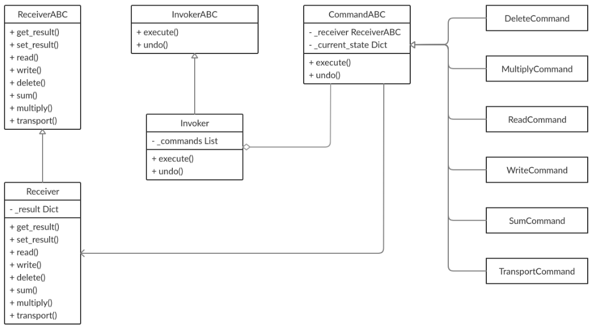

# matrices-comand

## [OTUS](https://otus.ru) homework

### Goal
Implement OOP pattern **Command**

### Description
This program can do some operations with matrices also the program can undo
completed operations.

### Class schema:


### Command
First, client init a need command object and call its method **execute**
with argument receiver object.
```python
invoker = Invoker()
receiver = Receiver()

receiver.get_result()  # {}
read_command = ReadCommand(receiver, read_from='matrices.json')
```
Second, invoker object get command, save it in stack and delegate execution to receiver.
```python
invoker.execute(multiply_command)
```
Then receiver execute command and we can get result.
```python
receiver.get_result()  # {'matrix_1': [[5, 8, -4], [6, 9, -5], [4, 7, -3]], 'matrix_2': [[3, 2, 5], [4, -1, 3], [9, 6, 5]]}
```
Also invoker can undo completed commands. Invoker get command from stack, call command undo method
and remove command from stack.
```python
invoker.undo()
receiver.get_result()  # {}
```

For more examples of command pattern look **examples**.

To run program:
```bash
$ python program_1.py
```

To run tests:
```bash
$ python -m unittest tests
```
